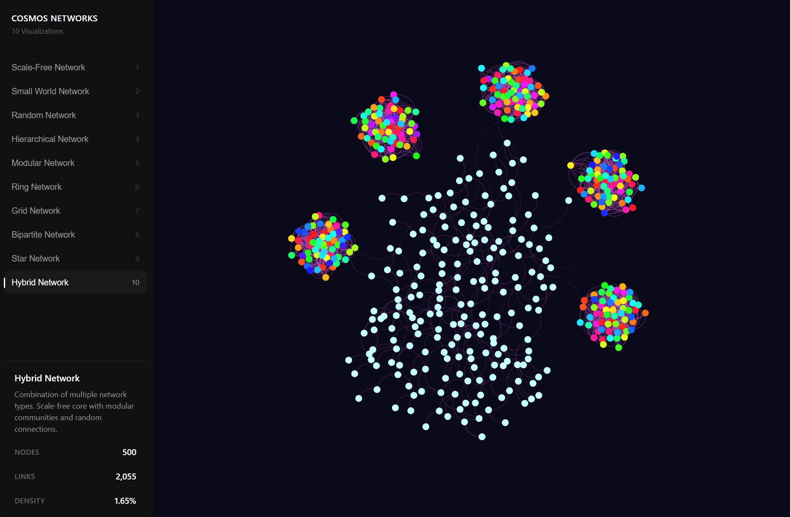

# Cosmos.gl Network Visualizations

<div align="center">
          
     </div>
    <br>

An interactive web application featuring 10 network visualizations built with [cosmos.gl](https://github.com/cosmosgl/graph), a GPU-accelerated graph visualization library.

## Network Types

1. **Scale-Free Network** - Barabási–Albert model with preferential attachment
2. **Small World Network** - Watts–Strogatz model with high clustering
3. **Random Network** - Erdős–Rényi model with random connections
4. **Hierarchical Network** - Tree-like structure with multiple levels
5. **Modular Network** - Community-based structure with dense clusters
6. **Ring Network** - Circular topology with additional connections
7. **Grid Network** - 2D grid structure with diagonal connections
8. **Bipartite Network** - Two distinct node groups with cross-connections
9. **Star Network** - Central hub with many peripheral nodes
10. **Hybrid Network** - Combination of multiple network types

## Getting Started

### Prerequisites

- Node.js 16+ and npm

### Installation

```bash
# Install dependencies
npm install
```

### Development

```bash
# Start development server
npm run dev
```

Open your browser to the URL shown in the terminal (typically `http://localhost:5173`).

### Build

```bash
# Build for production
npm run build
```

The built files will be in the `dist/` directory.

### Preview Production Build

```bash
# Preview production build
npm run preview
```

## Usage

1. Use the navigation buttons at the top to switch between different network visualizations
2. Click and drag nodes to move them around
3. Use mouse wheel to zoom in/out
4. Click and drag on empty space to pan the view
5. Click on nodes to see their information in the console

## Project Structure

```
cosmos-test/
├── index.html          # Main HTML file
├── src/
│   ├── main.js        # Main application logic
│   └── networks.js    # Network data generators
├── package.json       # Dependencies and scripts
├── .gitignore        # Git ignore rules
└── README.md         # This file
```

## License

MIT License - feel free to use this project for any purpose.


